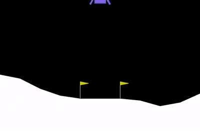

# Exploring AI and Computer Vision: A Learning Journey

### Courses:

#### 1. Artificial Intelligence A-Z
- Lunar Lander (DQN):
   - This code implements a Deep Q-Learning (DQN) algorithm to train an agent to solve the LunarLander-v3 environment from the Gymnasium library. The goal of the agent is to learn to control the lander and land it safely on the surface. It uses a neural network to estimate the Q-values for state-action pairs, which are updated using Q-learning, a reinforcement learning technique.
   - Check out this cool demo of my Lunar Lander AI!
   -  
- Pac-Man (DCQN):
  - This code implements a Deep Convolutional Q-Learning (DCQN) agent for the game Ms. Pac-Man, using reinforcement learning (RL) techniques. The agent is trained to play the game by interacting with the environment and learning from the outcomes of its actions.
  - Check out this cool demo of my agent playing Ms. Pac-Man!
   -  
- Kung-Fu (A3C):
  - This code implements a Asynchronous Advantage Actor-Critic (A3C) reinforcement learning algorithm to train an agent to play the game Kung Fu Master. A3C is an actor-critic method that uses multiple parallel environments to efficiently train the agent. The code uses Deep Learning with Convolutional Neural Networks (CNN) to process the visual input from the game and learn the optimal policy.
  - Check out this cool demo of my agent playing Kung Fu Master!
   -  

#### 2. Deep Learning and Computer Vision A-Z
- In-depth exploration of deep learning and computer vision techniques.
- Includes practical applications for real-world problem-solving.

#### 3. Python for Computer Vision with OpenCV and Deep Learning
- Practical course on computer vision using Python.
- Covers OpenCV library and deep learning techniques for image analysis.
